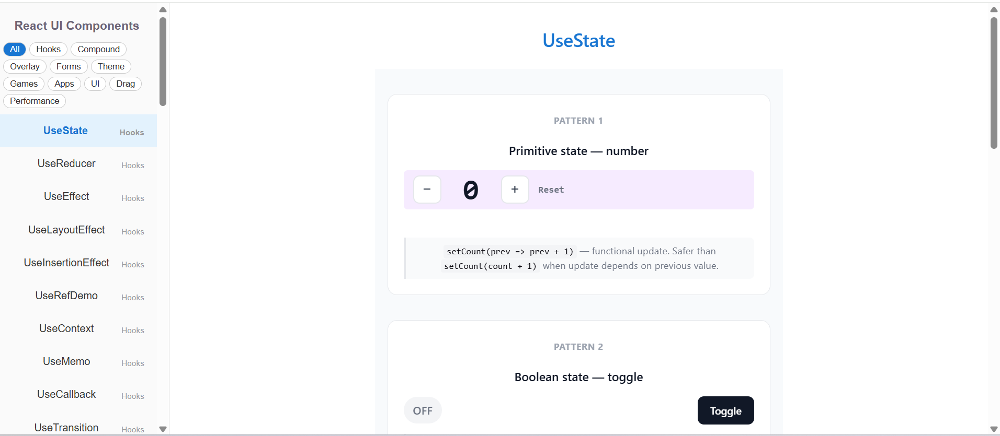
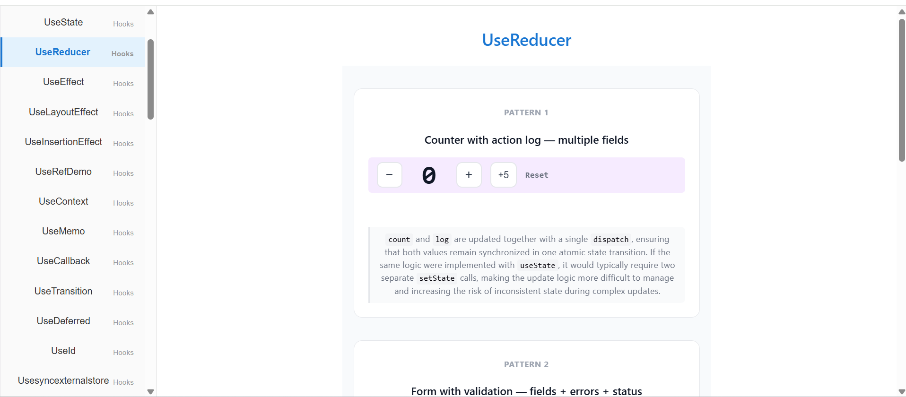
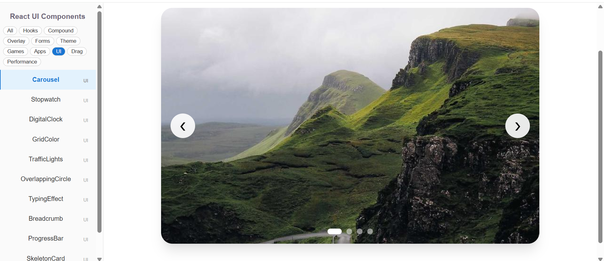
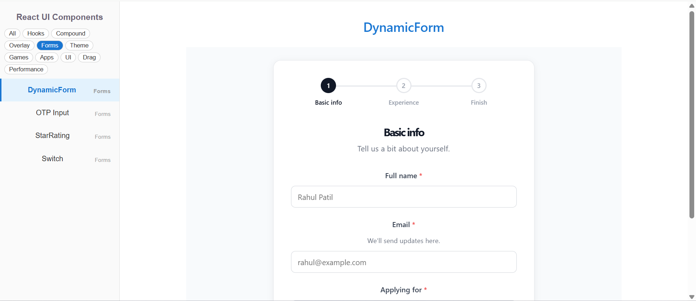
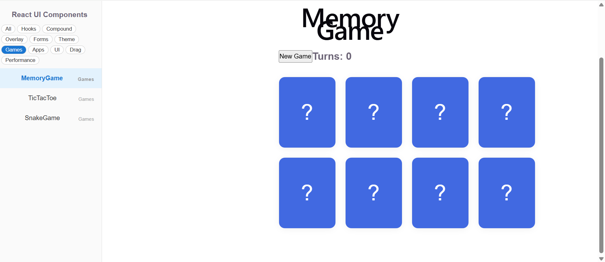
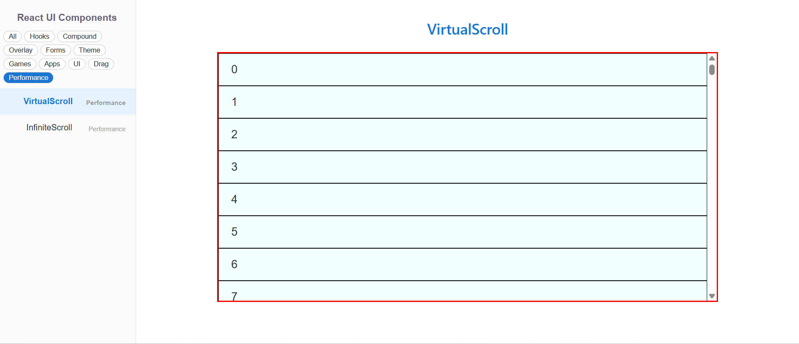

# 🚀 React Custom Components Library

A collection of **50+ reusable React components**, **React 19 hooks examples**, UI widgets, utilities, games, and interview-focused implementations built using **React**, **TypeScript**, **Vite**, **CSS**, and **Material UI**.

## 🌐 Live Demo

👉 https://rahulkarande1695.github.io/react-custom-components/

---

## ✨ Features

- ✅ 50+ Reusable Components
- ✅ React 19 Hooks Examples
- ✅ Compound Components
- ✅ Performance Optimizations
- ✅ TypeScript
- ✅ Responsive UI
- ✅ Clean Folder Structure
- ✅ Interview Ready Implementations

---

# 🛠 Tech Stack

- React 19
- TypeScript
- Vite
- CSS3
- Material UI
- React Hooks

---

# 📂 Components

## React Hooks

- useState
- useReducer
- useEffect
- useLayoutEffect
- useInsertionEffect
- useRef
- useContext
- useMemo
- useCallback
- useTransition
- useDeferredValue
- useId
- useSyncExternalStore
- useDebugValue
- useOptimistic
- useActionState
- useFormStatus

---

## Compound Components

- Accordion
- Pagination
- Popover
- Tabs

---

## Overlay Components

- Modal
- Toast
- Autocomplete
- Multi Select
- Calendar
- Time Picker

---

## Forms

- Dynamic Form
- OTP Input
- Switch
- Star Rating

---

## UI Components

- Carousel
- Stepper
- Progress Bar
- Breadcrumb
- Skeleton Loader
- Typing Effect
- Digital Clock
- Stopwatch
- Grid Color
- Traffic Lights
- Overlapping Circles

---

## Performance

- Infinite Scroll
- Virtual Scroll

---

## Drag & Drop

- Drag and Drop
- Table Row Drag

---

## Applications

- Todo App
- File Explorer

---

## Games

- Memory Game
- Tic Tac Toe
- Snake Game

---

# 🚀 Installation

```bash
git clone https://github.com/RahulKarande1695/react-custom-components.git
```

```bash
cd react-custom-components
```

```bash
npm install
```

```bash
npm run dev
```

---

# 📦 Build

```bash
npm run build
```

---

# 🚀 Deploy

```bash
npm run deploy
```

---

# 📸 Screenshots

## Home



---

## React Hooks



---

## UI Components



---

## Forms



---

## Games



---

## Performance


---

# 👨‍💻 Author

**Rahul Karande**

Frontend Developer

GitHub

https://github.com/RahulKarande1695

LinkedIn

(Add your LinkedIn profile)

---

## ⭐ Support

If you found this project useful, don't forget to ⭐ star the repository.
